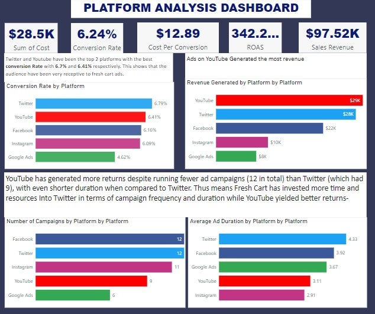

# Ad Analysis

## Introduction

This Power BI project aims to analyze advertising data for the fictional company “Fresh Cart.” By deriving insights from the data, we aim to answer crucial questions and provide actionable recommendations to help the store make informed decisions.

**_Disclaimer_**: _The data used in this analysis is purely fictional and created for educational purposes. Any resemblance to real individuals, companies, or events is coincidental. The dataset does not represent any actual business or organization, and the insights derived from it should be treated as hypothetical._

## Problem Statement

**FreshCart's Advertising Challenges:**

1. **Inefficient Ad Spend:**
   - FreshCart suspects that not all their digital advertising dollars are generating the desired return on investment (ROI).
   - Some campaigns may be costing more than they contribute in revenue.

2. **Identifying Effective Channels:**
   - FreshCart faces difficulty in determining which advertising platforms (search engines, social media, etc.) yield the best ROI.
   - Choosing the right channels is crucial in a competitive online grocery market.

As FreshCart aims to optimize its digital ad spend, addressing these challenges becomes essential. 🚀

## Project Objective: Optimizing FreshCart's Digital Ad Spending

**Specific Objectives:**

1. **Evaluate Campaign Effectiveness:**
   - Analyze the performance of current advertising campaigns across different platforms.
   - Metrics to consider: click-through rates (CTR), impressions, and conversions.

2. **Identify Top-Performing Channels:**
   - Determine which advertising channels (e.g., search engines, social media) yield the highest return on investment (ROI).
   - Consider cost per acquisition (CPA) and overall engagement.

3. **Assess Demographic Engagement:**
   - Segment the audience based on demographics (age, gender, location).
   - Evaluate engagement levels (likes, shares, comments) for each demographic group.

4. **Recommend Budget Allocation Strategies:**
   - Based on insights, propose adjustments to the ad budget allocation:
     - Allocate resources to high-performing channels.
     - Optimize spending for maximum impact.

## Skills and Concepts Demonstrated

The following power BI features were incorporated
- Data integration,
- cleaning and modeling,
- Dax,
- page navigation,
- filters

## Modelling

Certainly! The data model displayed in the screenshot combines two tables: "ad_campaign_data" and "DateTable." A relationship links these tables. The model helps analyze advertising metrics, track performance over time, and optimize ad spending for FreshCart. 

The “ad_campaign_data” table is the fact table and The “DateTable” is the dimension table.

## Dax Measures

### 1. Conversion Rate
- **Purpose:** Calculate the percentage of conversions relative to total clicks.
- **DAX Expression:**
  ```DAX
  Conversion Rate = DIVIDE(SUM(ad_campaign_data[Conversions]), SUM(ad_campaign_data[Clicks]), 0)
  ```
- **Explanation:** This measure divides the total conversions by total clicks, handling cases where there are no clicks (denominator is zero).

### 2. Cost Per Conversion
- **Purpose:** Determine the cost associated with each conversion.
- **DAX Expression:**
  ```DAX
  Cost Per Conversion = DIVIDE(SUM(ad_campaign_data[Cost]), SUM(ad_campaign_data[Conversions]), 0)
  ```
- **Explanation:** This measure calculates the average cost per conversion.

### 3. CTR (Click-Through Rate)
- **Purpose:** Measure the effectiveness of ads.
- **DAX Expression:**
  ```DAX
  CTR = DIVIDE(SUM(ad_campaign_data[Clicks]), SUM(ad_campaign_data[Impressions]), 0)
  ```
- **Explanation:** CTR calculates the ratio of clicks to impressions.

### 4. ROAS (Return on Ad Spend)
- **Purpose:** Evaluate revenue generated relative to advertising costs.
- **DAX Expression:**
  ```DAX
  ROAS = DIVIDE(SUM(ad_campaign_data[ConversionValue]), SUM(ad_campaign_data[Cost]), 0)
  ```
- **Explanation:** ROAS quantifies how efficiently ad spending translates into revenue.

---
## Visualization

The Report Contains 3 pages.
1. Home
2. Analysis
3. Campaign


---


---

## FreshCart's Effective Advertising Platform: YouTube vs. Twitter

### Overview:
FreshCart's advertising success hinges on choosing the right platform. Here's why YouTube stands out:

1. **High Conversion Rate:**
   - Both YouTube (6.41%) and Twitter (6.79%) surpass the e-commerce industry average (1-3%).
   - FreshCart's audience is receptive to ads on both platforms.

2. **Cost Efficiency:**
   - YouTube's Cost Per Conversion ($2.72) is significantly lower than Twitter's ($14.21).
   - YouTube effectively converts viewers into customers.

3. **Impressive ROAS (Return on Ad Spend):**
   - YouTube's ROAS: 1298.84% (Fresh Cart gets $12.99 for every ad dollar spent).
   - Twitter's ROAS: 420.18%.
   - YouTube delivers exceptional revenue relative to costs.

4. **Efficiency Metrics:**
   - YouTube outperforms Twitter in sales despite fewer campaigns (9 vs. 12) and shorter ad durations.

### Conclusion:
YouTube combines high conversion rates, impressive ROAS, and cost-effectiveness. It's the optimal choice for FreshCart's advertising strategy.

---

---

## Least Effective Advertising Platform: Google Ads

### Overview:
Google Ads, despite its widespread use, falls short in FreshCart's advertising strategy. Here's why:

1. **Lowest Conversion Rate:**
   - Google Ads has a meager conversion rate of 4.62%.
   - This rate significantly lags behind other platforms.

2. **Highest Cost Per Conversion (CPC):**
   - Acquiring a customer through Google Ads costs $35.
   - It's the most expensive platform in terms of conversion expenses.

3. **Least ROAS (Return on Ad Spend):**
   - Google Ads' ROAS, while positive, is considerably lower than other platforms.
   - FreshCart receives less return for each ad dollar spent.

4. **Revenue Comparison:**
   - Google Ads generated sales revenue of $8.07K.
   - While higher than Instagram, it falls significantly behind Twitter and Facebook.

### Conclusion:
Google Ads may need optimization or reconsideration to improve its effectiveness for FreshCart.

---
Certainly! Let's refine the conclusion and recommendations for FreshCart's advertising strategy across different platforms:

---

## Conclusion and Recommendations

### YouTube:

1. **Invest More in YouTube:**
   - Given its high ROAS (Return on Ad Spend), low cost per conversion, and significant sales revenue, consider increasing the budget allocation for YouTube advertising.
   - YouTube offers a cost-effective way to acquire customers.

2. **Analyze Successful Campaigns:**
   - Dive into the top-performing YouTube campaigns to identify content types that resonate best with the audience.
   - Extend successful campaigns' duration to capitalize on their performance.

### Twitter:

1. **Optimize Twitter:**
   - While Twitter has a good conversion rate and significant sales revenue, there's room for optimization.
   - Investigate areas for improvement:
     - Refine targeting.
     - Enhance creative content.
     - Evaluate individual campaign performance for better returns.

2. **Analyze Successful Campaigns:**
   - Deep dive into the top-performing Twitter campaigns to understand what content resonates with the audience.

### Google Ads:

1. **Reassess Google Ads Strategy:**
   - While Google Ads meets industry standards in conversion rate, it lags behind other platforms in terms of ROAS and sales revenue.
   - Address the highest cost per conversion:
     - Revisit targeted keywords.
     - Optimize ad creatives.
     - Improve landing pages.

2. **Deeper Analysis:**
   - Identify underperforming campaigns or ad groups within Google Ads and refine them accordingly.

### Overall:

- Explore **Retargeting Strategies** across all platforms:
  - Implement retargeting campaigns, especially where visitors might not have converted initially.
  - Improve overall conversion rates.

In conclusion, FreshCart has experienced success across multiple platforms, but there's always room for optimization and growth. By following these recommendations, FreshCart can enhance its digital efficiency and effectiveness.

---
